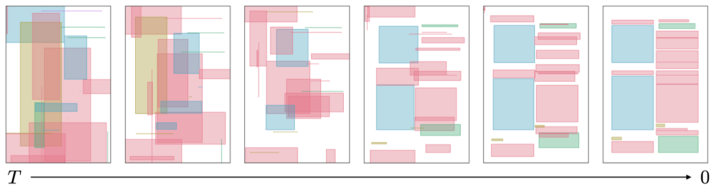

# Towards Aligned Layout Generation via Diffusion Model with Aesthetic Constraints

## Installation

```shell
pip install git+https://github.com/creative-graphic-design/LACE
```

---
source code of the layout generation model, [LACE](https://arxiv.org/abs/2402.04754).

## 1. Installation
### 1.1 Prepare environment
Install package for python 3.9 or later version:
```
conda create --name LACE python=3.9
conda activate LACE
python -m pip install -r requirements.txt
```

### 1.2 Checkpoints
Download the **trained checkpoints** for diffusion model and FID model at [Hugging Face](https://huggingface.co/datasets/puar-playground/LACE/tree/main) or through command line:
```
wget https://huggingface.co/datasets/puar-playground/LACE/resolve/main/model.tar.gz
wget https://huggingface.co/datasets/puar-playground/LACE/resolve/main/fid.tar.gz
tar -xvzf model.tar.gz
tar -xvzf fid.tar.gz
```
Model hyper-parameter:<br />
for Publaynet: `--dim_transformer 1024 --nhead 16 --nlayer 4 --feature_dim 2048` <br />
for Rico13 and Rico25: `--dim_transformer 512 --nhead 16 --nlayer 4 --feature_dim 2048` <br />

### 1.3 Datasets
The datasets are also available at:
```
wget https://huggingface.co/datasets/puar-playground/LACE/resolve/main/datasets.tar.gz
tar -xvzf datasets.tar.gz
```
Alternatively, you can download from the source and prepare each dataset as following:
* [PubLayNet](https://developer.ibm.com/exchanges/data/all/publaynet/): Download the `labels.tar.gz` and decompress to `./dataset/publaynet-max25/raw` folder. <br />
* [Rico](https://www.kaggle.com/datasets/onurgunes1993/rico-dataset): Download the `rico_dataset_v0.1_semantic_annotations.zip` and decompress to `./dataset/rico25-max25/raw` folder. <br />

When the dataset is initialized for the first time, a new folder callled `processed` will be created at e.g., `./dataset/magazine-max25/processed` containing the formatted dataset for future uses. Training split of smaller dataset: Rico and Magazine will be duplicated to reach a reasonable epoch size.


## 2. Testing
Run python script `test.py` to test. Please run `python test.py -h` to see detailed explaination. <br />
For PubLayNet:
```
python test.py --dataset publaynet --experiment all --device cuda:0 --dim_transformer 1024 --nhead 16 --batch_size 2048 --beautify
```
For Rico:
```
python test.py --dataset rico25 --experiment all --device cuda:0 --dim_transformer 512 --nhead 16 --batch_size 2048 --beautify
```


## 3. Training
Run python script `train_diffusion.py` to train.<br />
The script takes several command line arguments. Please run `python train_diffusion.py -h` to see detailed explaination.<br />
Example command for training:<br />
```
python train.py --device cuda:1 --dataset rico25 --no-load_pre --lr 1e-6 --n_save_epoch 10
```

## Reference
```
@inproceedings{
    chen2024towards,
    title={Towards Aligned Layout Generation via Diffusion Model with Aesthetic Constraints},
    author={Jian Chen and Ruiyi Zhang and Yufan Zhou and Changyou Chen},
    booktitle={The Twelfth International Conference on Learning Representations},
    year={2024},
    url={https://openreview.net/forum?id=kJ0qp9Xdsh}
}
```
